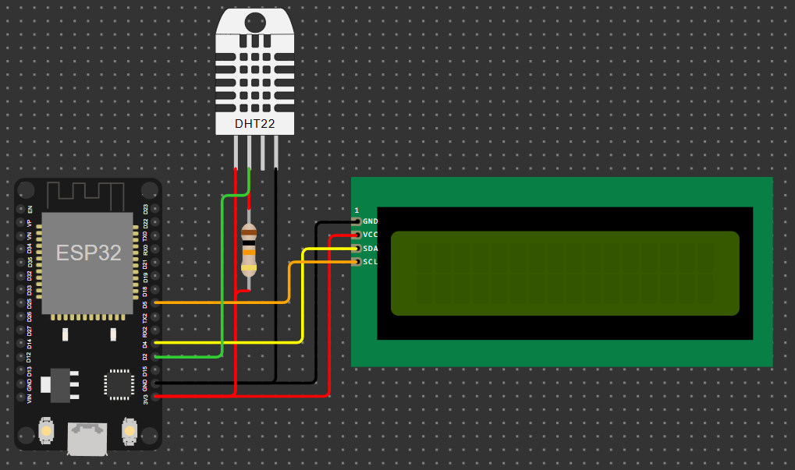

# ❓ What is this
The HomeLab aims to be a website that works in localhost and that allows you to do various things through its sections:
- **Home**  
Allows you to turn off/restart the site, see its system information, execute commands and if enabled, receive information about the ESP32 integration
- **Music Downloader**  
Allows you to download music from YouTube and play it on the site
- **Api Tool**  
  Allows you to send requests from the site and receive responses
- **Film Download**  
  Use Streaming Community API to view cracked movies in Italian
- **Cloud**  
  Similar to Google Drive; it allows you to upload files, edit them, rename them and create folders

> [!NOTE]
> The site is in **Italian** with some terms in English.

# Installation Guide
<b>🍓 <a href="Guide_Raspbian.md">Raspbian</a> </b>
 
<b>🪟 <a href="Guide_Windows.md">Windows</a> </b>

### • Setup ESP32 integration
Required components: 
- ESP32
- DHT11/DHT22 (the circuit was made to use a DHT11)
- LCD 16x2 (I2C)
- 10KΩ resistor
- Jumper Wires
- (Optional) Bread Board

 

First you need to connect the wires like in this circuit:

After that, you need to install MicroPython on the ESP32; I suggest using [this guide](https://docs.sunfounder.com/projects/esp32-starter-kit/en/latest/micropython/python_start/install_micropython.html).
  
Add the code present in the `code/ESP32` folder inside the ESP32 files and inside `code/HomeLab` then in the config (`app_config.json`) set `ESP32_integration` as `"True"`
  
Edit the `boot.py` file located in the `code/ESP32` folder and add the Wi-Fi SSID and password to the dictionary
